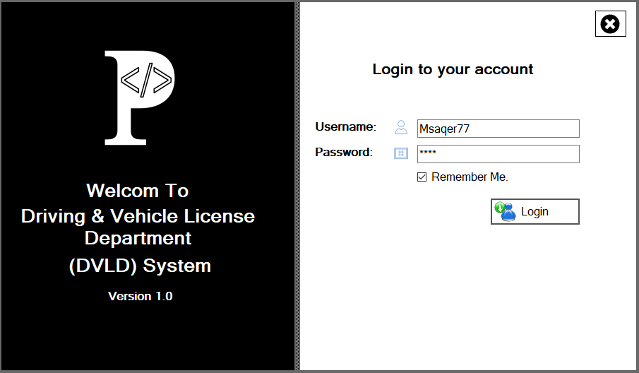
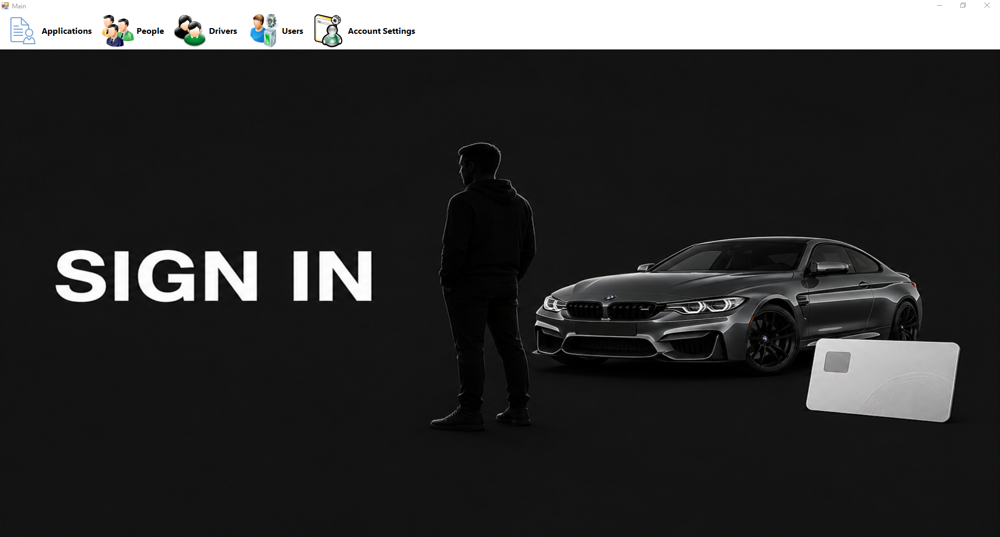
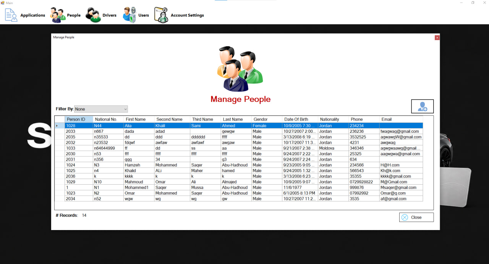

# 🚗 DVLD - Driver & Vehicle Licenses Department System

A desktop application built using **C# and Windows Forms** for managing driver licenses, applications, and users.
The system follows a **Three-Tier Architecture** to ensure clean separation of concerns and scalability.

---

## 📌 Features

* 👤 Manage People (Add / Edit / Delete)
* 🚗 Manage Drivers and Licenses
* 📄 Driving License Services:

  * Issue New License
  * Renew License
  * Replacement for Lost/Damaged License
  * Release Detained License
  * Retake Test
* 🧾 Manage Applications & Test Types
* 🔐 User Authentication System (Login / Permissions)
* ⚙️ Account Settings Management

---

## 🏗️ Architecture

This project is designed using **Three-Tier Architecture**:

* **Presentation Layer**

  * Windows Forms (UI)

* **Business Logic Layer**

  * Handles validation and core logic

* **Data Access Layer**

  * Handles database operations (SQL Server)

---

## 📂 Project Structure

* `DVLD` → Presentation Layer (UI)
* `DVLD_Business` → Business Logic
* `DVLD_DataAccess` → Data Access Layer

---

## 🖼️ Screenshots

### 🔐 Login Screen


### 🏠 Main Screen


### 👥 Manage People



### 🚗 Manage Drivers


### 👤 Manage Users


### 📄 Details Screen


---

## 🛠️ Technologies Used

* C#
* Windows Forms
* SQL Server
* ADO.NET

---

## 🚀 Getting Started

1. Clone the repository:

```
git clone https://github.com/your-username/DVLD.git
```

2. Open the solution in Visual Studio
3. Setup the database connection (SQL Server)
4. Run the project

---

## 💡 Notes

* This project was built as a practical application of software architecture concepts.
* Focused on clean code, separation of concerns, and real-world system simulation.

---

## 👨‍💻 Author

Developed by: **Hatem Hamdan**
